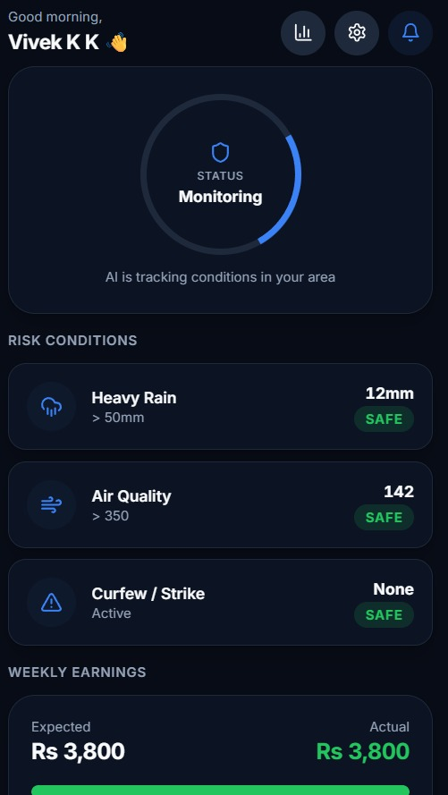
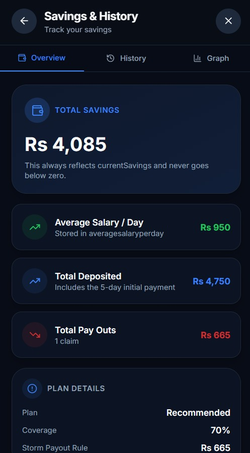
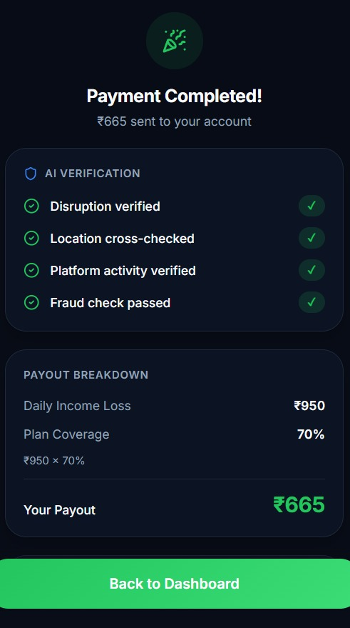

<picture align="center">
  <source media="(prefers-color-scheme: dark)" srcset=".github/gigguard.png">
  
</picture>

---

# DevTrails: Gig Worker Parametric Insurance Platform

DevTrails is an automated insurance platform built for gig economy workers. Instead of making users file manual claims, DevTrails uses real-time data (weather, pollution, government alerts) to automatically calculate and send payouts when a worker's income is disrupted.

[Watch the DevTrails Demo Video](https://drive.google.com/file/d/1m25NARxi40Km_5f3W1XcWx2suKA_Z8Wi/view)

## App Preview

| Onboarding | Active Monitoring | Payout Triggered |
| :---: | :---: | :---: |
|  |  |  |

---

## 1. The Persona: Who is the Worker?

Our system is built for **Rohan**, a 26-year-old delivery partner in Mumbai. 
* **The Problem:** A sudden monsoon flood costs him his daily earnings. Traditional insurance requires a physical damage claim, which does not cover lost time.
* **The Solution:** DevTrails detects severe rainfall in his exact delivery zone and automatically triggers a partial income replacement payout directly to his UPI.

---

## 2. Payout Logic & Math

The core payout calculation follows a simple weighted formula:

$$Payout = (I_p \times D_s) \times Coverage\%$$

* **$I_p$ (Predicted Income):** The worker's expected daily earnings, calculated using an LSTM model on their last 14 days of work.
* **$D_s$ (Disruption Severity):** A scale from 0.0 to 1.0 based on external API triggers (e.g., a Category 4 cyclone equals 0.8).
* **$Coverage\%$:** The protection tier the worker selected during onboarding (e.g., 80%).

> **Example:** > If Rohan's predicted income ($I_p$) is INR 1000, the flood severity ($D_s$) is 0.6, and his policy coverage is 80%, the payout is: 
> (1000 * 0.6) * 0.80 = **INR 480 automatically sent to his bank.**

---

## 3. Fraud Prevention & Anti-Spoofing

To prevent bad actors from using GPS-spoofing apps to fake their location and drain the insurance pool, we use a layered verification approach:

* **Motion Sensor Checks:** We check the phone's accelerometer and gyroscope. A fake GPS app shows a perfectly smooth path; a real delivery worker's phone shows the natural vibrations and tilts of riding a motorbike.
* **Network Cross-Checking:** We compare the phone's GPS coordinates with nearby Cell Towers and Wi-Fi networks. If the GPS says the user is in a flooded zone, but the Wi-Fi data says they are safely at home, the claim is flagged.
* **Fair Review Process:** If a claim looks suspicious, we do not auto-reject it. Instead, the app asks the worker to record a quick 5-second video of their surroundings. Our YOLOv8 computer vision model scans the video to confirm the weather conditions (like heavy rain or flooded streets).

---

## 4. System Architecture & Tech Stack

| Layer | Technology | Purpose |
| :--- | :--- | :--- |
| **Mobile** | Flutter (Dart) | App interface, biometric login, and sensor data collection. |
| **Backend** | Spring Boot (Java) | Core logic, user identity checks, and triggering payments. |
| **ML Engine** | FastAPI (Python) | YOLOv8 (Image checks), LSTM (Earnings prediction), Isolation Forest (Fraud detection). |
| **Database** | PostgreSQL, MongoDB | Relational user data (SQL), Document metadata and logs (NoSQL). |
| **Streams** | Apache Kafka | Managing high-speed data from thousands of active workers. |

---

## 5. Project Structure

```text
├── devtrails-mobile/          # Flutter application code
├── devtrails-backend/         # Spring Boot microservices
│   ├── identity-service/      # Rule-based validation & OAuth
│   ├── trigger-engine/        # Parametric logic & API integration
│   └── payment-service/       # UPI & Bank transfer orchestration
├── devtrails-ml/              # Python FastAPI services
│   ├── ocr-forgery/           # YOLOv8 and Tesseract implementation
│   ├── risk-prediction/       # LSTM and XGBoost models
│   └── fraud-detection/       # Isolation Forest & Sensor validation
├── infrastructure/            # Docker Compose & Kubernetes manifests
└── docs/                      # Architecture diagrams and API specs
```

---

## 6. Getting Started (Local Setup)

### Prerequisites
* Docker & Docker Compose
* Java 17+
* Python 3.10+
* Flutter SDK

### Installation

1. **Clone the repository:**
   ```bash
   git clone https://github.com/Shudharshan07/GigGuard.git
   cd GigGuard
   ```

2. **Configure Environment Variables:**
   Copy the sample environment file and add your API keys (Weather API, UPI Gateway).
   ```bash
   cp .env.sample .env
   ```

3. **Start the Infrastructure (Databases, Kafka, Redis):**
   ```bash
   cd infrastructure
   docker-compose up -d
   ```

4. **Run the ML Engine (FastAPI):**
   ```bash
   cd devtrails-ml
   pip install -r requirements.txt
   uvicorn main:app --reload --port 8000
   ```

5. **Run the Backend (Spring Boot):**
   ```bash
   cd devtrails-backend
   ./mvnw spring-boot:run
   ```

---

## 7. API Documentation

Here is an example of the trigger endpoint the backend uses to evaluate a weather event.

**POST** `/api/v1/trigger-evaluate`

**Request Payload:**
```json
{
  "worker_id": "gw_98765",
  "location": {
    "lat": 19.0760,
    "lng": 72.8777
  },
  "environmental_data": {
    "rainfall_mm": 65.2,
    "aqi": 110
  }
}
```

**Response (200 OK):**
```json
{
  "status": "TRIGGER_ACTIVATED",
  "disruption_severity": 0.65,
  "predicted_loss_inr": 650,
  "fraud_flag": false,
  "next_action": "INITIATE_PAYOUT"
}
```

_Full API documentation and Postman collections can be found in `/docs/api-specs.yaml`._

---

## 8. Contribution Guidelines

We welcome contributions to improve DevTrails.

1. Fork the Project.
2. Create your Feature Branch (`git checkout -b feature/AmazingFeature`).
3. Commit your Changes (`git commit -m 'Add some AmazingFeature'`).
4. Push to the Branch (`git push origin feature/AmazingFeature`).
5. Open a Pull Request.
