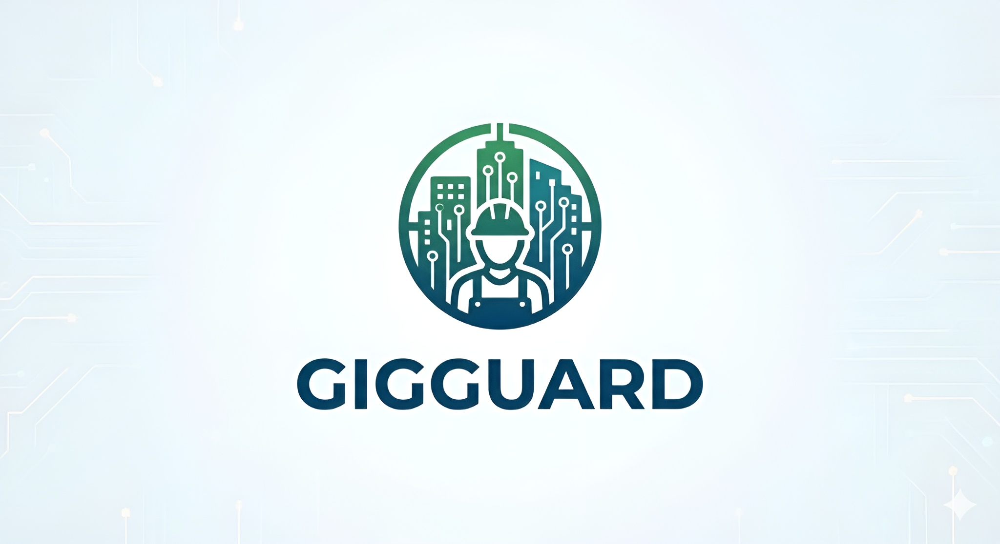

<picture align="center">
  <source media="(prefers-color-scheme: dark)" srcset=".github/gigguard.png">
  
</picture>

---

# DevTrails: Gig Worker Parametric Insurance Platform

DevTrails is an automated, parametric insurance solution designed to provide financial protection for gig economy workers. Unlike traditional insurance, this platform uses real-time data triggers (weather, pollution, or government curfews) to automatically calculate and issue payouts for income loss without a manual claims process.

## System Architecture

The platform is built on a distributed microservices architecture consisting of a Flutter mobile client, a Spring Boot orchestration layer, and a Python-based ML/Computer Vision engine.

### 1. User Onboarding & Identity Validation
* **Registration:** Flutter-based mobile application with OAuth and Biometric authentication (Fingerprint).
* **Document Upload:** Users submit Aadhaar, PAN, Gig ID, and Bank proof.
* **OCR & Forgery Detection:** * **Tesseract/EasyOCR:** Extracts text from uploaded documents.
    * **ML Models:** Uses **YOLOv8** for specific tampering detection (Photoshop/ID changes) and **EfficientNet/ResNet50** for generic forgery identification.
* **Rule Engine:** Validates identity by matching names across Aadhaar, PAN, and Gig IDs.

### 2. Risk & Trigger Engines
* **External Data Collection:** Real-time monitoring of Weather APIs (rainfall/heat), AQI (pollution), News (strikes), and Government Alerts (lockdowns).
* **Risk Prediction Engine:** * **LSTM / Facebook Prophet:** Predicts disruption impact and weather-related income loss.
    * **XGBoost / LightGBM:** Models income loss prediction (e.g., calculating ₹ loss based on disruption percentage).
* **Parametric Trigger Engine:** Core logic that executes payouts based on pre-defined thresholds (e.g., Rainfall > 50mm AND delivery drop > 30%).

### 3. Payout & Fraud Management
* **Fraud Detection System:** Utilizes **Isolation Forest** models to detect suspicious claim patterns or fake environmental signals.
* **Payout Calculation:** Calculates settlement using `Predicted Income Loss x Coverage %`.
* **Automated Payment:** Integrated UPI/Bank Transfer system for daily or weekly settlement cycles.

---

## Technical Stack

| Layer | Technology |
| :--- | :--- |
| **Frontend** | Flutter (Dart) |
| **Backend** | Spring Boot (Java), FastAPI (Python) |
| **Database** | PostgreSQL (User profiles/Policies), MongoDB (Document metadata/Logs) |
| **Cache** | Redis (Sessions, API responses) |
| **ML/CV** | YOLOv8, ResNet50, EfficientNet, XGBoost, Facebook Prophet |
| **Monitoring** | Grafana, Loki |

---

## Project Structure

```text
├── devtrails-mobile/          # Flutter application code
├── devtrails-backend/         # Spring Boot microservices
│   ├── identity-service/      # Rule-based validation & OAuth
│   ├── trigger-engine/        # Parametric logic & API integration
│   └── payment-service/       # UPI & Bank transfer orchestration
├── devtrails-ml/              # Python FastAPI services
│   ├── ocr-forgery/           # YOLOv8 and Tesseract implementation
│   ├── risk-prediction/       # LSTM and XGBoost models
│   └── fraud-detection/       # Isolation Forest implementation
├── infrastructure/            # Docker Compose & Kubernetes manifests
└── docs/                      # Architecture diagrams and API specs
```

---

## Workflow

1.  **Onboarding:** User registers and passes OCR/Forgery checks.
2.  **Monitoring:** The platform continuously polls external APIs for disruption signals.
3.  **Trigger:** If a parametric threshold is met (e.g., severe storm), the Risk Engine predicts the income loss.
4.  **Validation:** The Fraud Detection system verifies the signal's authenticity.
5.  **Settlement:** The Payment system automatically pushes the calculated payout to the user's bank account via UPI.

## Monitoring & Logging
The system uses **Grafana** and **Loki** to track:
* Backend and ML pipeline logs.
* Real-time claim events and payout approval rates.
* System health and API latency.
